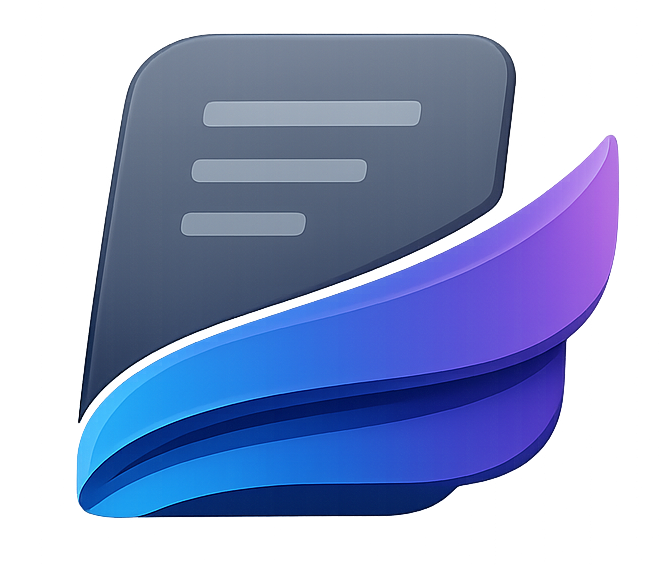

  
  <h1>Nuvopad</h1>
  

    <strong>The local-first, VS Code-inspired notebook for developers.</strong>
  

  

    <a href="https://github.com/cybesis/nuvopad">GitHub</a> •
    <a href="#download">Download</a> •
    <a href="CHANGELOG.md">Changelog</a> •
    <a href="#support">Support</a>
  

  
<strong>Latest: v2.4.0</strong>

---

## Overview

Nuvopad is designed for those who appreciate the speed, aesthetics, and keyboard-centric workflow of modern code editors but need a dedicated space for notes. It combines the power of Markdown with a beautiful, local-first architecture.

### Key Features

*   **Local-First Architecture**: Your data resides securely on your device. No cloud lock-in.
*   **VS Code Aesthetic**: A familiar, dark-themed interface with syntax highlighting that feels like home.
*   **Markdown Support**: First-class Markdown editing with GFM support (tables, task lists, code blocks).
*   **Source Mode**: Seamless toggle between WYSIWYG and a raw, line-numbered source code editor (`Ctrl+Alt+S`).
*   **Developer Friendly**: Keyboard shortcuts, command palette-like navigation, and code snippets.
*   **Organization**: Powerful tagging system, nested notebooks, and instant search.
*   **Favorites & Trash**: Star notes for quick access; soft-delete with restore support.
*   **Instant Sidebar**: Note titles and body previews update in real time as you type.

### Pro Features 💎

Unlock the full potential of Nuvopad with the Pro add-on:

*   **Default Editor Mode**: Choose your preferred starting environment—**Markdown Source** or **WYSIWYG**—and have it remembered across sessions.
*   **Focus Mode**: A distraction-free writing environment that hides UI clutter.
*   **Custom Templates**: Create and reuse templates for engineering logs, meeting notes, bug reports, and more.
*   **Advanced Theme Control**: Access to exclusive premium themes and customization options.
*   **Data Restore & Backup**: robust tools to safeguard your notes and restore from backups.
*   **Attachments**: Drag-and-drop image and file support directly into your notes.

## Documentation

### Getting Started

1.  **Installation**: Download and install Nuvopad from the Microsoft Store or via the release installer.
2.  **Creating Notes**: Use `Ctrl+N` or click the `+` icon in the sidebar to create a new note.
3.  **Organization**: Group related notes into **Notebooks** and use **Tags** for quick filtering.

### Power User Tips

*   **Quick Search**: Press `Ctrl+K` (or focus search bar) to instantly filter through your notes.
*   **Source Mode**: Press `Ctrl+Alt+S` to toggle the raw Markdown source view for precise editing.
*   **Task Lists**: Use `- [ ]` and `- [x]` to create interactive checklists.

## Download

Available now on Windows.

[**Get it from Microsoft Store**](#) *(Link coming soon)*

## Roadmap

We are constantly improving Nuvopad. Here is what's on the horizon:

*   [ ] **Cloud Sync (Optional)**: End-to-end encrypted synchronization across devices.
*   [ ] **Plugin System**: Community-driven extensions to add new capabilities.
*   [ ] **Vim Mode**: Enhanced keybindings for modal editing.

## Support the Developer

Nuvopad is built with passion. If you find value in this tool and wish to support its continued development, consider becoming a patron or buying me a coffee. Your support directly funds new features and maintenance.

*   [**Patreon**](https://patreon.com/miztizm)
*   [**Buy Me a Coffee**](https://buymeacoffee.com/miztizm)

---

  Built with ❤️ by Cybesis 
  Local First • Developer Focused

